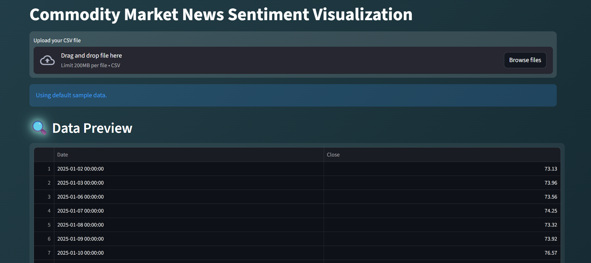
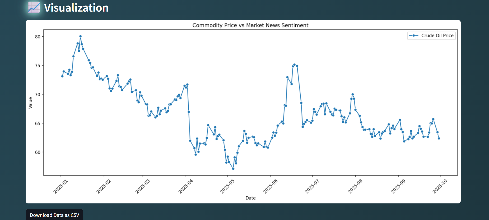

# 📊Commodity Market News Sentiment Analysis

## Overview
This project analyzes commodity market news, performs sentiment analysis, and visualizes how news sentiment correlates with commodity prices (e.g., crude oil).

  

  

## Features
- Scrapes latest market news.
- Performs sentiment analysis (Positive, Negative, Neutral).
- Fetches commodity prices using Yahoo Finance.
- Merges news sentiment with daily commodity prices.
- Visualizes trends and patterns using Matplotlib & Seaborn.

## Tech Stack
- Python: Pandas, BeautifulSoup, TextBlob, yfinance, Matplotlib, Seaborn

## How to Run
1. Clone the repository.
2. Install dependencies: `pip install -r requirements.txt`
3. Run all steps: `py -m streamlit run app.py`

## Outcome
- Interactive visualization of commodity price vs news sentiment.
- Insights for trading, market prediction, or operational decisions.
